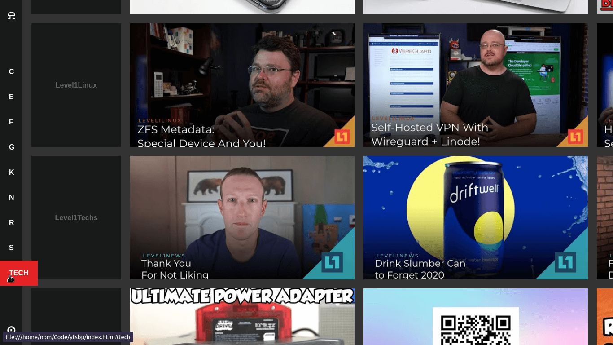

# Youtube subscriptions player
Basic youtube RSS subscriptions player.

##How to:
1. You will need **bash**, **grep**, **curl** and **sed** to use this, so basically any linux distro ( for WIN and MAC explore solutions )
2. Download this repo ( git checkout or get ZIP and unpack ) and put it in any folder you like.
3. **subs** subfolder is where you place subscriptions to channels and whay to do this is 
	3.1. **create folder** for category ( whatever you like, name of the folder is 1:1 name of the category )
	3.2. **create single file** (name whatever you like)
	3.3. subscription file just needs to have **youtube channel ID** ( use this tool https://commentpicker.com/youtube-channel-id.php )
	3.4. cd to directory and **run ytsbp**
4. open generated **index.html** in any semi-modern browser
	4.1 *You will have to run ytsbp any time you wish to refresh feed*

##Obligatory screenshot
